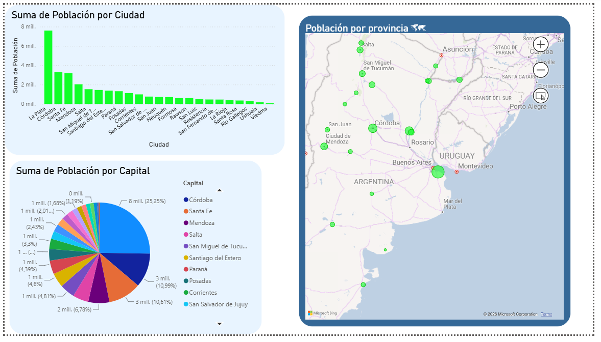
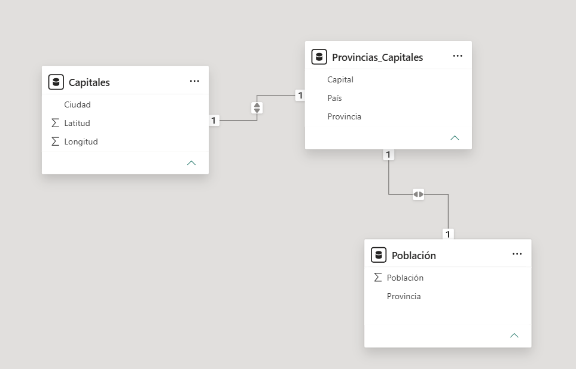
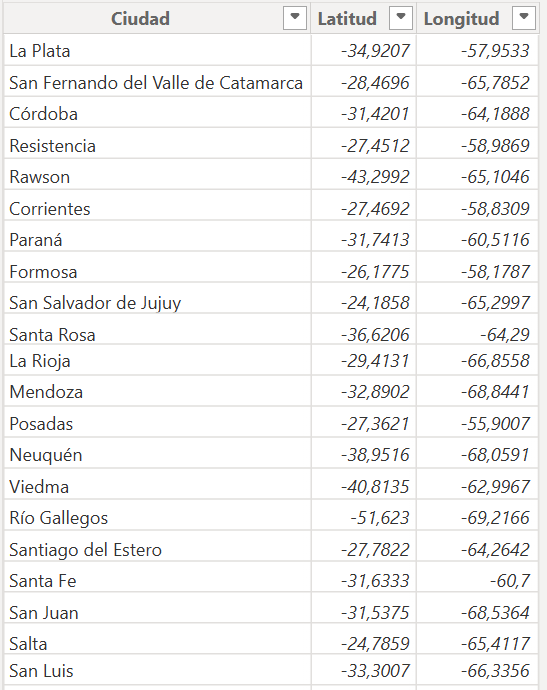
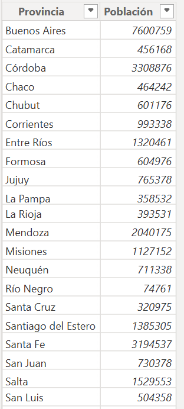
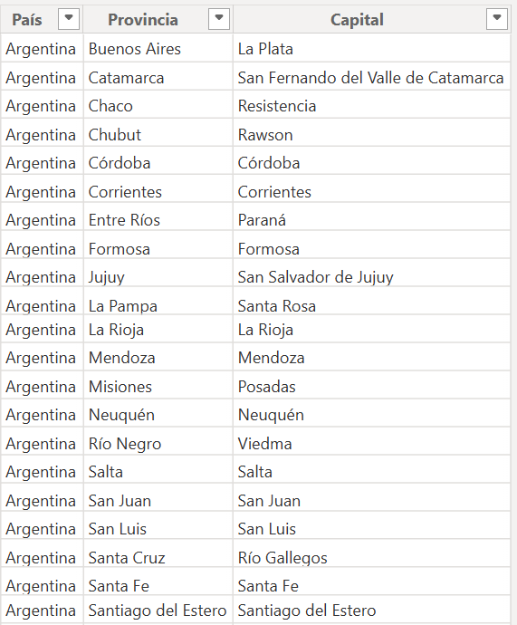

# Dashboard de Población por Provincias - Argentina

## Descripción
Dashboard interactivo en Power BI con análisis geográfico y demográfico 
de las provincias de Argentina, construido con modelo de datos relacional.

## Vista del dashboard

## Modelo de datos

3 tablas relacionadas:
- **Capitales** — coordenadas geográficas (latitud/longitud) de cada capital
- **Población** — población total por provincia
- **Provincias_Capitales** — tabla puente que relaciona provincia con su capital

## Tablas del modelo

## Visualizaciones incluidas
- Mapa interactivo de burbujas georreferenciadas por provincia
- Gráfico de barras: población por ciudad capital
- Gráfico de torta: distribución porcentual por capital

## Herramientas
Power BI Desktop · Power Query · Modelado relacional

## Archivos
 (Análisis%20geográfico%20Argentina.pbix) Archivo Power BI con el dashboard completo 

## Autor
Juan Burbano — Estudiante de Ingeniería de Sistemas | UNAD  
[LinkedIn](https://www.linkedin.com/in/juan-david-burbano-pineda-181b61296/))
